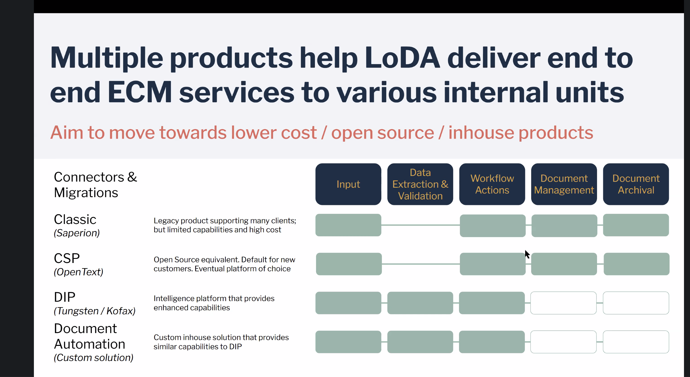
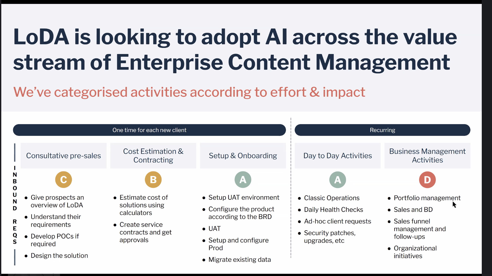

# LoDA

Workshop training content and examples for LoDA AI enablement.

## Programme

Two tracks. Start with the [schedule](mercedes-loda-training-reference/schedule.md).

### Track 1 — Foundational AI

| Order | Topic |
| --- | --- |
| 1 | [Conversational AI & Prompts Engineering](workshop-content/foundational-ai) |

### Track 2 — Advanced AI 

| Order | Topic |
| --- | --- |
| 1 | [Building AI Systems & LLM Calls (2 days)](workshop-content/advanced/Day-1-2-AI-systems-LLM-calls.md) |
| 2 | [Deep Dive into Agentic Workflows (1 day)](workshop-content/advanced/Day-3-deep-dive-agentic-workflows.md) |
| 3 | [Multi-Agent Orchestration](mercedes-loda-training-reference/advanced-ai/day-2.md) |
| 4 | [LLM Fundamentals, Benchmarking & Local LLMs](mercedes-loda-training-reference/advanced-ai/day-3.md) |
| 5 | [RAG Fundamentals](mercedes-loda-training-reference/advanced-ai/day-4.md) |
| 6 | [AI Workflows for Enterprise Software Development](mercedes-loda-training-reference/advanced-ai/day-5.md) |

## Examples

n8n workflows, importable as JSON.

- [Email Responder](examples-n8n/example-email-responder/1_Email%20Responder.json)
- [Email Responder — ReAct](examples-n8n/example-email-responder/2_Email%20Responder%20-%20ReAct.json)

## LoDA Products & Teams

