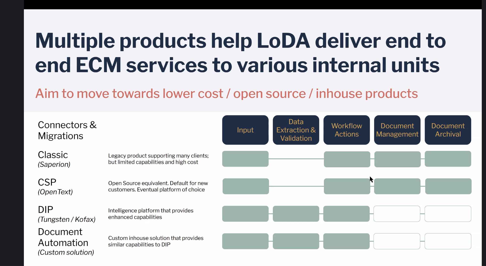
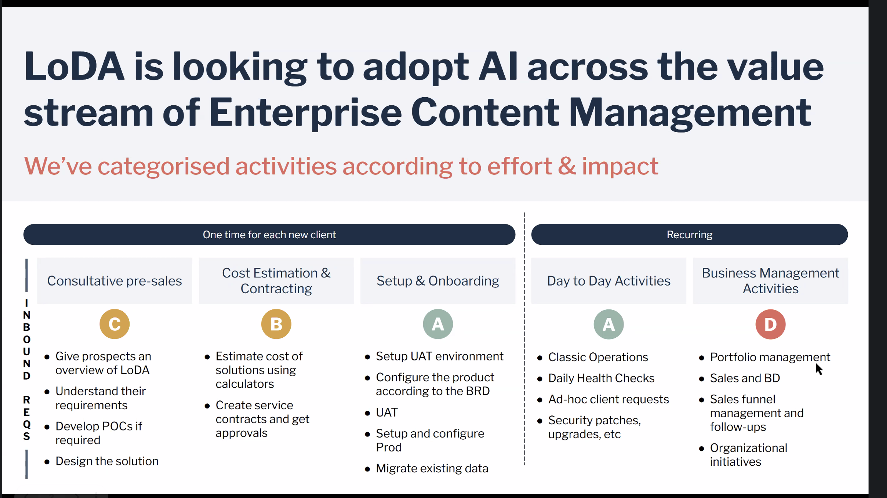

# LoDA

Workshop training content and examples for LoDA AI enablement.

## Programme

Two tracks. Start with the [schedule](mercedes-loda-training-reference/schedule.md).

### Track 1 — Foundational AI

| Order | Topic |
| --- | --- |
| 1 | **[Conversational AI & Importance of Context](workshop-content/foundational-ai)** Why context shapes every response |
| 2 | **[Prompt Engineering](workshop-content/foundational-ai)** Structure, techniques, and frameworks |
| 3 | **[Double Diamond](workshop-content/foundational-ai)** Frame the right problem first |
| 4 | **[Prompt → Skill → Agents](workshop-content/foundational-ai)** The evolution of automation |
| 5 | **[AI Patterns and Anti Patterns](workshop-content/foundational-ai)** What works, what fails |

### Track 2 — Advanced AI 

| Order | Topic |
| --- | --- |
| 1 | **[Building AI Systems & LLM Calls (2 days)](workshop-content/advanced/Day-1-2-AI-systems-LLM-calls.md)** How LLM calls and system prompts work under the hood |
| 2 | **[Deep Dive into Agentic Workflows (1 day)](workshop-content/advanced/Day-3-deep-dive-agentic-workflows.md)** Tools, memory, and guardrails for autonomous agents |
| 3 | **[Multi-Agent Orchestration](mercedes-loda-training-reference/advanced-ai/day-2.md)** Coordinating agents that work together |
| 4 | **[LLM Fundamentals, Benchmarking & Local LLMs](mercedes-loda-training-reference/advanced-ai/day-3.md)** Comparing models and running them locally |
| 5 | **[RAG Fundamentals](mercedes-loda-training-reference/advanced-ai/day-4.md)** Vector databases and retrieval-augmented generation |
| 6 | **[AI Workflows for Enterprise Software Development](mercedes-loda-training-reference/advanced-ai/day-5.md)** Applying AI across the dev lifecycle |

## Examples

n8n workflows, importable as JSON.

- [Email Responder](examples-n8n/example-email-responder/1_Email%20Responder.json)
- [Email Responder — ReAct](examples-n8n/example-email-responder/2_Email%20Responder%20-%20ReAct.json)
- [Brunch Planner — agentic workflow, 4 files](examples-n8n/example-brunch-planner/README.md)

## LoDA Products & Teams

