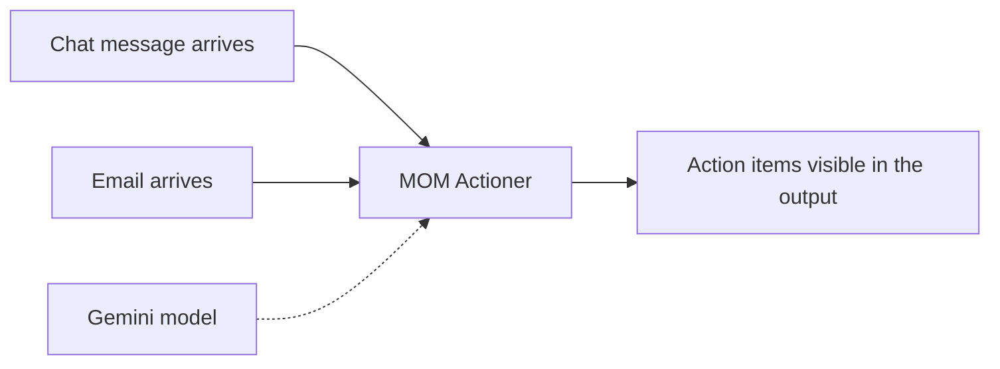
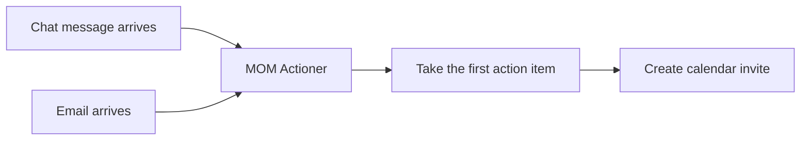
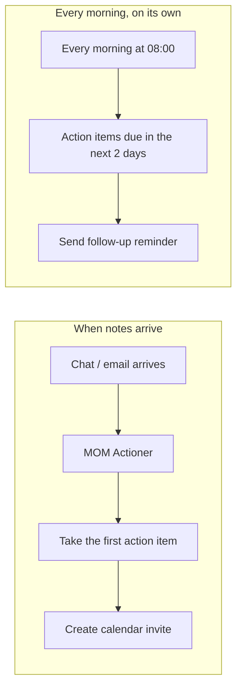
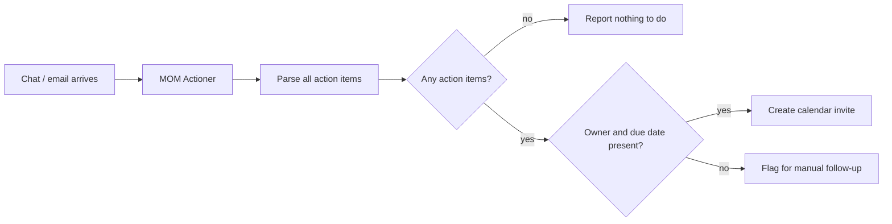

# MOM Actioner — Skill → Workflow (trainer reference)

Reference solutions for the four build cycles. **Do not hand these out at the start.** Each cycle is 10 minutes of implementation followed by 10 minutes of demo; these files exist so you always have something working to show if a pair doesn't get there after the hint.

**Sample input:** `sample-data/data-migration-process-mom.md` (paste the action-items section, or the whole document, into the chat input).

**How to use during the session:**

1. Give the requirement only. No node names.
2. If a pair stalls, give the implementation hint (one line, in the cycle section below).
3. If they're still stuck at the end of the build slot, import the cycle's JSON and drive it live on the projector — the canvas *is* the visual. Pause on the node they were missing and let them see its settings panel.
4. The mermaid diagram in each section is the static fallback for slides, if you'd rather not switch to n8n mid-explanation.

**Before the session:** import all four into your own n8n instance, re-point the Gmail / Google Calendar / Gemini credentials at your accounts, and replace `sahil.renapurkar.official@gmail.com` with your own address in the calendar and email nodes. Run each one once so you know they work in your environment.

---

## Cycle 1 — Invoke/Start skill from via a chat message or Email

**Requirement (read this out):** "Right now, after every meeting, someone has to open the MOM Actioner and paste the notes in themselves. I want the notes to reach it on their own — whether the team drops them in a chat or sends them across by email — so that nothing is sitting there waiting on a person to remember."

**Hint, if they stall:** Set up a chat input or an email trigger to kick things off.

**Demo checkpoint:** Send a chat message or email; the workflow starts by itself and the skill's output appears.

**File:** `1_MOM Actioner - Cycle 1 Trigger.json`

**What to reveal in the demo:** two different triggers can feed the same downstream step — the workflow doesn't care where the notes came from. Show the output panel: the skill has already produced the action items, and nothing has been sent anywhere yet.

---

## Cycle 2 — Handle the first action item, from start to end.

**Requirement:** "At the moment all we get back is a list, and someone still has to put those items into a calendar by hand. Let's start small — just the first action item. I want it to land in the owner's calendar on its own, with the right task and the right date, so that nobody is retyping what the meeting already decided."

**Hint, if they stall:** Map the skill's output to the fields you need, then send the invite/message.

**Demo checkpoint:** One action item in, one correct invite out, fields match the notes exactly.

**File:** `2_MOM Actioner - Cycle 2 First Action Item.json`

**What to reveal in the demo:** the skill returns text, and text can't be dropped straight into a calendar field — something in between has to turn it into named fields the next step can read. That in-between step is the whole reason this is a workflow and not a skill.

---

## Cycle 3 — introduce Followup Process, Don't let it get forgotten.

**Requirement:** "Once something is in the calendar it goes quiet, and we only find out it slipped at the next meeting. I want the owner to hear about an action item before it's due, not after — so that chasing people stops being somebody's job."

**Hint, if they stall:** Bring in a new step, email or otherwise, that fires based on the due date.

**Demo checkpoint:** A follow-up goes out for an item whose due date is near or past.

**File:** `3_MOM Actioner - Cycle 3 Due Date Follow-up.json`

**What to reveal in the demo:** this is the cycle that usually stalls, so expect to drive it. The point to land: nothing *arrives* to trigger a follow-up. Time passing is not an event the workflow receives — so the workflow has to go and look on a schedule. That's a second, separate starting point in the same workflow, with no connection to the first one.

**If you're short on time:** set the schedule to every minute instead of 08:00 so the room sees it fire during the session, and create a test calendar event due tomorrow beforehand.

---

## Cycle 4 — Every item, and the empty case

**Requirement:** "We've only been handling one item so far, and a real meeting throws up ten. I want every action item from the minutes handled the same way. And if a meeting genuinely had none, I don't want anyone getting an invite or being chased about nothing."

**Hint, if they stall:** Loop over every item; add a check for when the list is empty.

**Demo checkpoint:** Run with notes that have several items — all get invites. Run with notes that have none — the workflow ends clean, no invite, no crash.

**File:** `4_MOM Actioner - Cycle 4 All Action Items.json`

**What to reveal in the demo — three things, in this order:**

1. **They probably built an explicit loop, and they didn't have to.** Once the parsing step produces one item per action, every step after it runs once per item automatically. Show the execution view with "9 items" on the connection. This is usually the biggest single lesson of the session.
2. **The empty case needs its own path.** If the parsing step returns nothing at all, nothing travels downstream and nothing happens — including the "nothing to do" message. That's why the reference sends one item saying *there are no action items* rather than sending zero items.
3. **The incomplete rows.** Run the real `data-migration-process-mom.md`: row 8 has `*Unassigned*` as the owner and `Next review` as the due date. The workflow does not guess a person and does not invent a date — it routes that row to a human instead. Call back to the guardrail from the earlier session: never infer a value that isn't there.

**Note:** cycle 4's requirement as written doesn't mention the incomplete rows. If you want pairs to solve that themselves, say so explicitly when you give the requirement; otherwise treat it as a reveal in your demo, or set it as take-home.

---

## Stretch, only if a pair finishes early

Wire the Copilot Studio skill to n8n directly, so the MOM Actioner output arrives without anyone copying and pasting it. Everything in cycles 1–4 assumes the notes are pasted in by hand, which is fine — the workflow rung is the new material here, not the connector.
