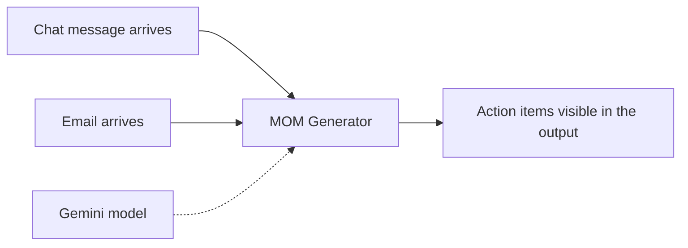
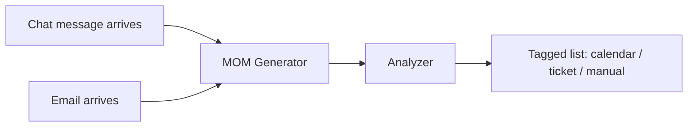
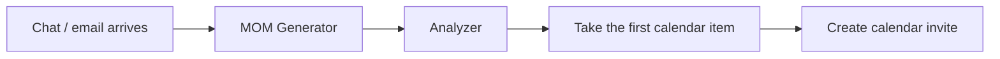
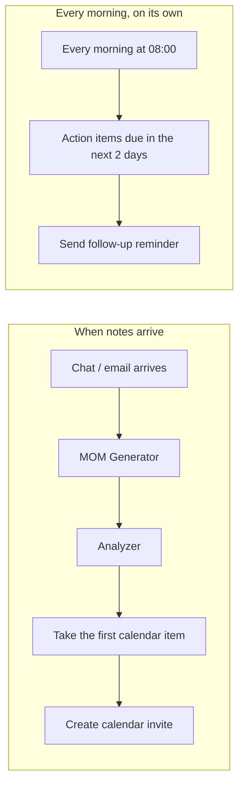
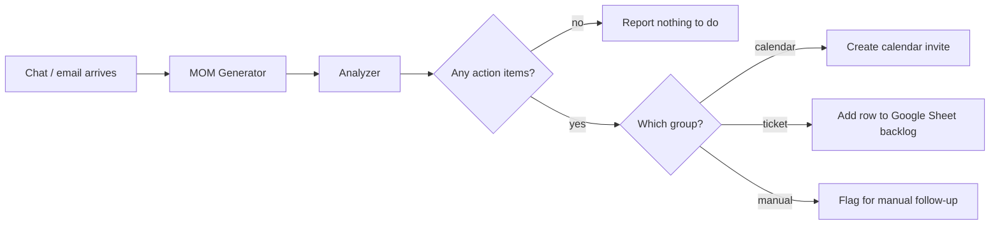

# MOM Generator — Skill → Workflow (trainer reference)

Reference solutions for the five build cycles. **Do not hand these out at the start.** Each cycle is 10 minutes of implementation followed by 10 minutes of demo; these files exist so you always have something working to show if a pair doesn't get there after the hint.

**Sample input:** `sample-input-data/data-migration-process-mom.md` (paste the action-items section, or the whole document, into the chat input).

**How to use during the session:**

1. Give the requirement only. No node names.
2. If a pair stalls, give the implementation hint (one line, in the cycle section below).
3. If they're still stuck at the end of the build slot, import the cycle's JSON and drive it live on the projector — the canvas *is* the visual. Pause on the node they were missing and let them see its settings panel.
4. The mermaid diagram in each section is the static fallback for slides, if you'd rather not switch to n8n mid-explanation.

**Before the session:** import all five into your own n8n instance, re-point the Gmail / Google Calendar / Gemini / Google Sheets credentials at your accounts, and replace `sahil.renapurkar.official@gmail.com` with your own address in the calendar and email nodes. In cycle 5's "Add row to Google Sheet backlog" node, replace the placeholder sheet URL (`REPLACE_WITH_YOUR_SHEET_ID`) with a real spreadsheet that has an `Action / Owner / Due date / Why it's a ticket / Status` header row. Run each one once so you know they work in your environment.

---

## Cycle 1 — Invoke/Start skill from via a chat message or Email

**Requirement (read this out):** "Right now, after every meeting, someone has to open the MOM Generator and paste the notes in themselves. I want the notes to reach it on their own — whether the team drops them in a chat or sends them across by email — so that nothing is sitting there waiting on a person to remember."

**Hint, if they stall:** Set up a chat input or an email trigger to kick things off.

**Demo checkpoint:** Send a chat message or email; the workflow starts by itself and the skill's output appears.

**File:** `1_MOM Generator - Cycle 1 Trigger.json`

**What to reveal in the demo:** two different triggers can feed the same downstream step — the workflow doesn't care where the notes came from. Show the output panel: the skill has already produced the action items, and nothing has been sent anywhere yet.

---

## Cycle 2 — Sort the action items before anyone acts on them

**Requirement:** "Not everything out of a meeting is a meeting. Some of these need time blocked with people; some are just work that belongs in the backlog; and some aren't actionable at all — no owner, no date. Right now we treat them all the same. I want them sorted by what actually needs to happen to them, before anybody acts on anything."

**Hint, if they stall:** Add a second step after the skill that reads each action item and tags it — three tags: needs a meeting, is backlog work, or needs a human to decide first.

**Demo checkpoint:** The list comes back with every item tagged. Nothing sent anywhere yet — this cycle only sorts.

**File:** `2_MOM Generator - Cycle 2 Analyzer.json`

**What to reveal in the demo:** this is a *second* LLM call with one job, not a bigger prompt bolted onto the first one — direct callback to prompt chaining from the Day-1-2 session. Also point out this cycle sends nothing: you can check the Analyzer's thinking is right before wiring any consequence to it. That's "build and test in chunks" made concrete.

**Categories, fixed for the exercise (don't let pairs invent their own — three is what fits in 10 minutes):**
- `calendar` — needs time blocked with other people (a meeting, a review, a decision made together)
- `ticket` — one person's own work, belongs in a backlog (drafting, sizing, investigating, supplying a file)
- `manual` — no named owner or no real due date; a human decides first, wins over whatever the action text says

---

## Cycle 3 — Handle the first calendar item, from start to end

**Requirement:** "At the moment all we get back is a sorted list, and someone still has to put the calendar-worthy items into a calendar by hand. Let's start small — just the first one tagged 'needs a meeting.' I want it to land in the owner's calendar on its own, with the right task and the right date, so that nobody is retyping what the meeting already decided."

**Hint, if they stall:** Filter the Analyzer's output down to the calendar group, then map the first item's fields into an invite.

**Demo checkpoint:** One calendar-tagged action item in, one correct invite out, fields match the notes exactly.

**File:** `3_MOM Generator - Cycle 3 First Calendar Item.json`

**What to reveal in the demo:** the skill returns text, and text can't be dropped straight into a calendar field — something in between has to turn it into named fields the next step can read, and now that in-between step also has to pick the right item out of a mixed list, not just the first row in a plain array. That's the whole reason this is a workflow and not a skill.

---

## Cycle 4 — Don't let it get forgotten

**Requirement:** "Once something is in the calendar it goes quiet, and we only find out it slipped at the next meeting. I want the owner to hear about an action item before it's due, not after — so that chasing people stops being somebody's job."

**Hint, if they stall:** Bring in a new step, email or otherwise, that fires based on the due date.

**Demo checkpoint:** A follow-up goes out for an item whose due date is near or past.

**File:** `4_MOM Generator - Cycle 4 Due Date Follow-up.json`

**What to reveal in the demo:** this is the cycle that usually stalls, so expect to drive it. The point to land: nothing *arrives* to trigger a follow-up. Time passing is not an event the workflow receives — so the workflow has to go and look on a schedule. That's a second, separate starting point in the same workflow, with no connection to the first one.

**If you're short on time:** set the schedule to every minute instead of 08:00 so the room sees it fire during the session, and create a test calendar event due tomorrow beforehand.

---

## Cycle 5 — Every item, every group, and the empty case

**Requirement:** "We've only been handling one calendar item so far, and a real meeting throws up ten, across all three groups. I want every action item from the minutes handled the way its group needs: calendar items get invites, backlog items land somewhere the team already tracks work, and the ones missing an owner or a date get flagged for a person, not guessed at. And if a meeting genuinely had no action items, nobody gets an invite, a backlog row, or chased about nothing."

**Hint, if they stall:** No loop needed if the Analyzer already produces one item per action — route on the group tag instead: three branches, one per category, plus a check for an empty list.

**Demo checkpoint:** Run with notes that have all three kinds of item — calendar items get invites, ticket items appear as new rows in a shared Google Sheet, manual items get flagged in a message to a person. Run with notes that have none — the workflow ends clean, nothing created, nothing sent.

**File:** `5_MOM Generator - Cycle 5 All Action Items.json`

**What to reveal in the demo — four things, in this order:**

1. **They probably built an explicit loop, and they didn't have to.** Once the Analyzer produces one item per action, every step after it runs once per item automatically. Show the execution view with "9 items" on the connection. Usually the biggest single lesson of the session.
2. **The empty case needs its own path.** If parsing returns nothing at all, nothing travels downstream and nothing happens — including the "nothing to do" message. That's why the reference sends one item saying *there are no action items* rather than sending zero items.
3. **The group tag is doing the routing, not a pile of IF conditions re-deriving it.** The Analyzer already decided calendar vs. ticket vs. manual in cycle 2 — cycle 5 just reads that decision. If a pair re-checks "does it have an owner and a date" here too, point out the duplicate logic.
4. **The incomplete rows.** Run the real `data-migration-process-mom.md`: row 8 has `*Unassigned*` as the owner and `Next review` as the due date — the Analyzer already tagged it `manual`. The workflow does not guess a person and does not invent a date — it routes that row to a human instead. Call back to the guardrail from the earlier session: never infer a value that isn't there.

**Note:** cycle 5's requirement as written doesn't call out the incomplete rows by name. If you want pairs to solve that themselves, say so explicitly when you give the requirement; otherwise treat it as a reveal in your demo, or set it as take-home.

---

## Stretch, only if a pair finishes early

Wire the Copilot Studio skill to n8n directly, so the MOM Generator output arrives without anyone copying and pasting it. Everything in cycles 1–5 assumes the notes are pasted in by hand, which is fine — the workflow rung is the new material here, not the connector.
