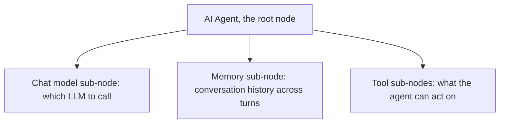
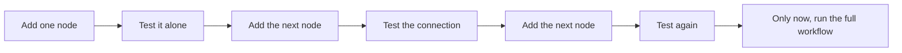

# Advanced Day 1: Deep Dive on Agentic Workflows

**Track:** Advanced AI

---

## Scope note

Day 3 of From Prompting to Workflows introduced the idea of an agentic workflow and had the room build one, end to end, already built for them to extend. This day goes underneath that, what a workflow is actually made of, piece by piece, and how to build one up from nothing rather than extend one already given. Tool-first-principles, then the n8n translation.

**Recap:** open with a recap of Day 3, per the standing daily structure.

**Purpose:** Day 3 handed the room a working email workflow and let them extend it. That is a good first taste, but it means nobody has actually built one from an empty canvas yet. This day exists to fix that, by naming every component a workflow is made of, then teaching a way of building that does not require getting the whole thing right on the first attempt.

---

## What any agentic workflow is actually made of

Underneath any platform, an agentic workflow is built from three kinds of pieces:

1. **LLM calls**, a system prompt and a user prompt, exactly what Day 1 of From Prompting to Workflows already covered. Nothing new here, this is that same worked example, now as one component inside a larger thing.
2. **Integrations**, a connection to an external app, Gmail, Outlook, and similar, each one exposing its own specific set of actions (send, search, read) and requiring its own credential.
3. **Custom tools**, a piece of logic you write yourself, for the moment when no integration covers what you need.

Every workflow, no matter how complex it looks, is some combination of these three things wired together.

---

## How n8n represents these three things as nodes

**Purpose:** the room already understands the three components conceptually. This section is the direct translation, this concept becomes this node, so the platform stops being a black box.

| n8n node type       | What it is for                                                                                         |
| ------------------- | ------------------------------------------------------------------------------------------------------ |
| Trigger nodes       | What starts the workflow, a schedule, a webhook, a form, a chat message                                |
| Action or app nodes | The integrations, Gmail, Outlook, and hundreds of others, each exposing its own specific actions       |
| Core nodes          | The logic that is not an integration, see the table below                                              |
| AI cluster nodes    | An AI Agent root node, with sub-nodes attached to it for the chat model, memory, and tools it can call |

**The core nodes worth knowing by name:**

| Node         | Its one job                                                                                                 |
| ------------ | ----------------------------------------------------------------------------------------------------------- |
| If           | Split the workflow into two paths based on one condition                                                    |
| Switch       | Split into more than two paths based on multiple conditions                                                 |
| Merge        | Combine outputs from separate branches back into one                                                        |
| Set          | Shape or transform the data moving through, without calling anything external                               |
| Code         | Write JavaScript directly, for the case nothing built-in covers, this is where a custom tool actually lives |
| HTTP Request | Call any REST API directly, for a service with no dedicated integration node                                |
| Webhook      | Expose a URL that starts the workflow when something else calls it                                          |

**The AI cluster node structure:**

The agent node itself decides which tool to call and when, the same LLM call from Day 1, now with the model deciding when to reach for one of the tools plugged into it.

---

## Method, part 1: choose your model empirically, not by assumption

**Purpose:** this is the exact same skill Day 1 taught for prompting, applied one level up, to the choice of model itself.

The same prompt, "fix spelling and grammar", run across Claude, ChatGPT, and Groq, will not perform identically. The right way to decide which model an LLM call node should use is to actually run the comparison on a task the room cares about, not to assume the newest or most talked-about model is automatically the right one for this specific job. Whichever model wins that comparison is the one that goes in the node. and if you don't have clear idea around which model to use, you are on the wrong track. there is no need to build workflow yet, when you already know you already have tried solving the problem in bits and pieaces and also an individual chunks testing is when to start building workflow and it helps with your experiments you already know which model work for this pieace and which won't (atleast to start with).

---

## Method, part 2: build and test in chunks, never the whole workflow first

**Purpose:** this is the single most important shift this day is trying to make. Left alone, people build the entire workflow, then run it once, and have no idea which of the six nodes is the one that broke. This is the same discipline as unit testing before integration testing, just applied to a workflow canvas instead of a codebase.

Concretely: add the trigger, confirm it actually fires. Add the LLM call node alone, test its prompt against sample input before anything is connected to it. Add the integration node, test its credential and its one action in isolation. Only once every piece has been proven on its own does the full chain get run together for the first time.

---

## Hands-on

Take a use case gathered on Day 2 of From Prompting to Workflows, or a new small one. In pairs: name its three components (the LLM call, the integrations it needs, any custom tool), sketch it before touching the canvas, then build and test it exactly in the order above, one node, one test, before the next node goes in.

---

## Resources

- [n8n Docs, node types](https://docs.n8n.io/integrations/), source for the trigger, action, and core node taxonomy
- [n8n Docs, cluster nodes](https://docs.n8n.io/integrations/builtin/cluster-nodes/), source for the AI Agent root node and sub-node structure

