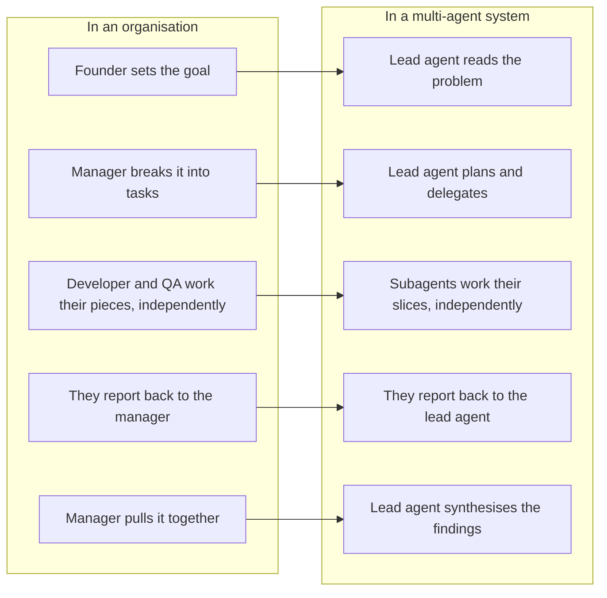
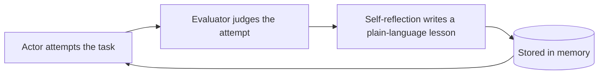

# Advanced Day 2: Multi-Agent Orchestration
**Track:** Advanced AI

---

## Scope note

Advanced Day 1 went underneath a single workflow, what it is made of and how to build one piece by piece. This day goes past a single workflow entirely, into what changes once more than one agent is working the same problem. Grounded in real, published research on production multi-agent systems.

**Recap:** open with a recap of Advanced Day 1.

**Purpose:** everything so far, Day 3's single workflow and Advanced Day 1's component-by-component build, has been one agent. This day is what changes once there is more than one.

---

## The orchestrator-worker pattern

**Purpose:** this is the one architecture worth teaching by name, because it is what most real multi-agent setups converge on. Everything else in this block is either the case for it or the cost of it.

A lead agent reads the problem, breaks it into pieces, and delegates each piece to a specialised subagent. The subagents work in parallel, each in its own context window, then report back to the lead agent, which synthesises their findings into one answer.

This is the same shape as how a team already works. A founder hands a goal to a manager. The manager breaks it into pieces and hands them to their developers and QAs. Each of them works their piece independently, then reports back. The manager pulls the results together into one thing to show the founder.



One more lever worth knowing: subagents that call several of their own tools at once, not just one after another, add further speed on top of running multiple subagents in parallel.

---

## The tradeoff, stated honestly

In one published comparison, a multi-agent system outperformed a single agent on the same task by 90.2%. It also used roughly 15 times the tokens a single chat interaction would use. Multi-agent is not a free upgrade over a single well-prompted agent, it is a genuine cost-for-performance trade, worth it for open-ended, high-value tasks where the parallel exploration itself is the point, not worth it for anything a single agent could do in a few tool calls.

**Decision heuristic:** if the task can be scoped into 1 agent with 3 to 10 tool calls, it does not need to be multi-agent. If the task genuinely branches into independent lines of investigation that would otherwise run one after another, that is the shape multi-agent is for.

---

## Two failure stories worth teaching directly

One system spawned 50 subagents for a query that needed one. Another had 3 subagents duplicate the same research instead of dividing it, because the delegation was too vague. Same root cause both times: the lead agent's briefing to its subagents.

**Vague, causes duplication:**

```
Research the semiconductor shortage.
```

**Specific and bounded, divides the work:**

```
Research the 2021 automotive chip shortage specifically, its causes and
which manufacturers were hit hardest. A separate subagent is covering the
2025 supply chain situation, so stay focused on the 2021 event and do not
duplicate that ground. Report back with dated sources.
```

Briefing a subagent is briefing a colleague, vague gets overlap, specific and bounded gets a clean split.

---

## Two named multi-agent patterns

Two shapes worth knowing by name, the room may meet either in the wild:

1. **Manager pattern:** one agent holds the other agents as tools it can call, similar in spirit to the orchestrator-worker pattern above.
2. **Handoff pattern:** an agent transfers full ownership of the task to a different, more specialised agent, rather than delegating and waiting for a result back.

---

## Reflexion, worth teaching with real enthusiasm

**Purpose:** this is one of the strongest ideas in this whole day, worth slowing down for and presenting as a genuine favourite, not just another technique to list. The reason it earns that: it is one of the few methods here where you can show the room outputs actually getting better, attempt over attempt, without retraining or fine-tuning anything.

The idea: instead of a single attempt at a task, the system keeps a running, written memory of what went wrong last time, in plain language, and uses that memory to do better on the next attempt.

Three roles make this work:

1. **The actor**, does the task, the same as any agent so far.
2. **The evaluator**, judges how it went, this is the same LLM-as-judge idea covered below, just applied one attempt at a time instead of after the fact.
3. **The self-reflection step**, turns that judgment into a short, written lesson, in plain language, not a score, and stores it.



That stored memory is what makes this different from just retrying. Each attempt carries forward everything the system has already written down about its own past mistakes. In one published benchmark of multi-step tasks, adding this loop took a system from struggling to completing 130 out of 134 attempts.

---

## Evaluating a multi-agent system

Two layers, not one.

**LLM-as-judge**, fast and scalable, scoring outputs against a small, plain rubric. Three metrics worth teaching, no more, so the room gets the idea rather than a checklist to memorise:

- **Factual accuracy**, did it get the facts right.
- **Citation accuracy**, do the sources it points to actually say what it claims they say.
- **Completeness**, did it cover what was actually asked, not just part of it.

**Human testers**, slower, but they catch what a rubric cannot. One well-documented case found a system quietly favouring SEO-optimised content farms over authoritative but less highly-ranked sources, like academic PDFs, a bias no automated score picked up because it was not looking for it.

The single most valuable thing a human tester can do goes further than checking specific outputs: read a real batch of production queries directly, by hand, not just the ones the LLM judge flagged as failures, a genuinely unfiltered sample. This finds problems no per-query score ever will, where users are actually getting frustrated, where they quietly stop using the tool altogether. That is usually a design problem in the system itself, not a mistake in any single LLM call, and reading raw usage in bulk is often the only way it surfaces at all.

**The teaching point:** an automated judge only finds what you thought to ask it to look for. Human review, especially unfiltered production review, exists to find what you did not think to ask about.

---

## Hands-on

**Purpose:** building a real multi-agent system properly is not a day's work. Keep the concept teaching above to roughly two to three hours, and spend the rest of the day hands-on with something that already exists, rather than trying to build one from an empty canvas in the time left.

Give the room one working multi-agent example, in whatever tool is already available to them (an existing n8n multi-agent template, or Claude Code's own subagent feature, whichever fits what they already have access to). In pairs: run it, trace where the orchestrator-worker split actually shows up, spot where reflection or evaluation could be added, and make one real extension to it rather than building one from scratch.

---

## Resources

- [Anthropic, How we built our multi-agent research system](https://www.anthropic.com/engineering/multi-agent-research-system), source for the orchestrator-worker pattern, the tradeoff numbers, and both failure stories
- [OpenAI, Agent orchestration patterns](https://developers.openai.com/api/docs/guides/agents), source for the manager and handoff pattern names
- [promptingguide.ai, Reflexion](https://www.promptingguide.ai/techniques/reflexion), source for the Reflexion framework and the benchmark result
