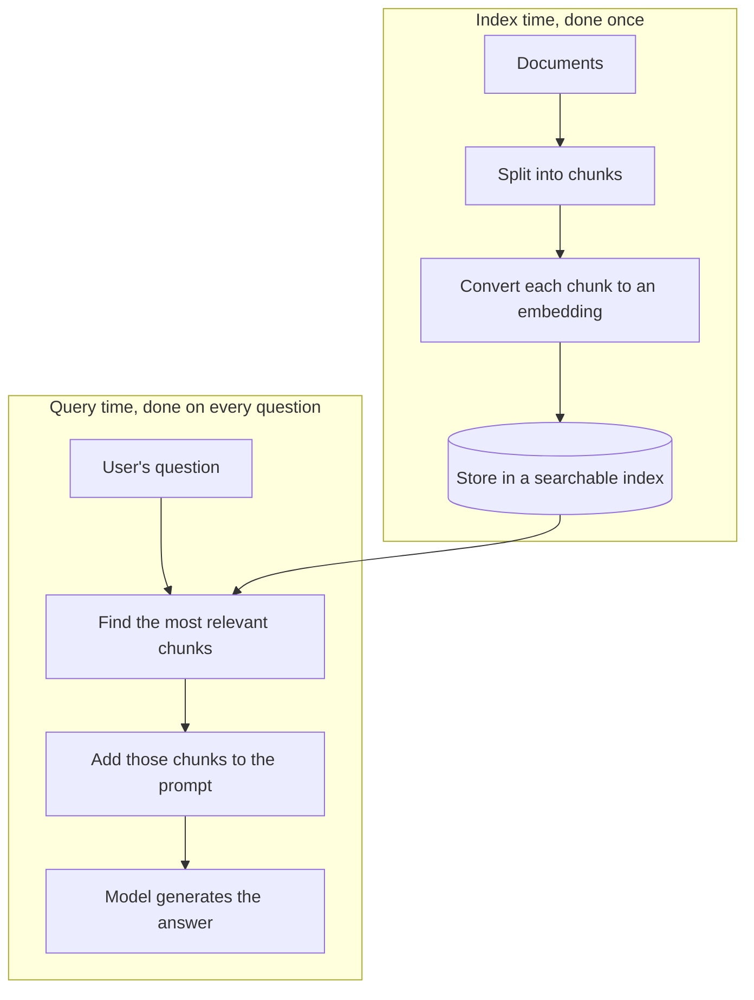

# Advanced Day 4: RAG Fundamentals

**Track:** Advanced AI

---

## Scope note

RAG is what you reach for once a knowledge base is bigger than any context window could hold. This day covers why the naive version of it quietly fails, and what a well-published fix, Contextual Retrieval, does differently, with the actual numbers behind it, not just the claim.

**Recap:** open with a recap of Advanced Day 3.

---

## What RAG actually is

**Purpose:** name the mechanism plainly before getting into where it breaks, so the room has the full picture before the failure mode lands.

Retrieval-Augmented Generation means the model does not need to know everything, it needs to be handed the right few pieces of a much larger knowledge base at the moment it needs them.




### The same idea the room already knows from SQL

If you have ever written a query like `SELECT * FROM orders WHERE customer_id = 123`, you already understand the shape of this. You are asking a structured store for the exact rows that match a condition. RAG does the same job on unstructured text, documents, PDFs, wikis, instead of database rows. The differences: the "query" is a natural-language question instead of a sql query language, and the match is on meaning instead of an exact value, finding whichever chunks are conceptually closest to what is being asked rather than which rows equal 123. Same underlying idea either way, do not hand over everything, hand over just the relevant slice.

---


## Why naive RAG quietly fails

**Purpose:** this is the part that is easy to skip past, RAG systems do not fail loudly, they fail by returning a plausible-sounding wrong answer, and the room needs to know exactly why before trusting one.

The problem is context loss during chunking. A document gets split into pieces so it can be searched and embedded, but an isolated piece often loses the surrounding information that made it meaningful in the first place.

A real example: a financial filing question, "what was ACME Corp's Q2 2023 revenue growth", might retrieve a chunk that says only this.

```
The company's revenue grew by 3% over the previous quarter.
```

Which company. Which quarter. Grew from what base. None of that survived the chunking. The chunk is accurate and useless at the same time.

---


## Chunking techniques, the two worth knowing

**Purpose:** dozens of chunking approaches exist. Most rooms only need two, the simple baseline, and the one that actually fixes its main weakness.

1. **Fixed-size chunking**, the simplest approach, split the document every so many characters or tokens, done. Fast, but it does not care about meaning, it can slice a sentence, or a single idea, straight down the middle.
2. **Semantic chunking**, splits at natural conceptual boundaries instead, using how similar nearby sentences are to decide where one chunk ends and the next begins, so each chunk stays a coherent, complete idea.

**A real example worth using in the room:** an HR policy handbook. Fixed-size chunking might cut straight through the sentence "employees are entitled to [chunk break here] 20 days of annual leave, prorated from their start date", splitting the entitlement away from its own number. Semantic chunking keeps that whole policy statement together as one chunk, because it respects the idea boundary rather than a fixed character count.

The trade-off, stated honestly: semantic chunking retrieves better, but costs more to build, it needs an embedding comparison across the document up front, not just a ruler.

---


## Contextual Retrieval, the fix

Rather than embedding the bare chunk, Contextual Retrieval prepends a short, chunk-specific explanation of where that chunk sits in the larger document, generated once, before indexing.

```
This chunk is from an SEC filing on ACME Corp's performance in Q2 2023; the
previous quarter's revenue was $314 million. The company's revenue grew by
3% over the previous quarter.
```

The same fact, now self-contained. It survives being pulled out of the document on its own.

### The results, stated plainly


| Approach                                   | Reduction in retrieval failures |
| ------------------------------------------ | ------------------------------- |
| Contextual embeddings alone                | 35%                             |
| Combined with keyword search (BM25)        | 49%                             |
| Combined with keyword search and reranking | 67%                             |


Worth landing directly: this is not a marginal tweak, two thirds of retrieval failures gone with the full combination, on a mechanism most naive RAG implementations skip entirely.

### Two simple things worth checking, once it is built

Two plain checks, not a full evaluation framework, so the room has a way to sanity-check a RAG system without needing anything elaborate:

- **Context relevance**, did the chunks it retrieved actually relate to the question asked, before the model even started generating an answer.
- **Faithfulness**, does the final answer actually stick to what the retrieved chunks said, or did the model add things those chunks never supported.

A system can fail at either point independently, good retrieval with an unfaithful answer, or a faithful answer built on the wrong chunks. Worth checking both, not just whether the final answer sounded right.

---


## Hands-on, part 1: feel the difference

Take a real multi-page document, ideally something from the room's own work. In pairs:

1. Split it into chunks the naive way, by length, with no added context.
2. Pick three chunks at random and check honestly, would this chunk make sense to someone who has never seen the rest of the document.
3. Rewrite those three chunks with a one or two sentence contextual prefix, the same way the ACME Corp example does.
4. Compare: what would a retrieval system have gotten wrong with the naive version that the contextual version fixes.

---


## Hands-on, part 2: build one real example

**Purpose:** part 1 builds the intuition by hand. This builds the actual thing, small enough to finish in the room, real enough to make everything above concrete.

Using n8n's vector store node, build a small RAG pipeline over one real document the room already has, an onboarding doc, a policy handbook, anything genuinely theirs:

1. Chunk it, fixed-size or semantic, pick one and say why.
2. Use the vector store node's Insert Documents mode to embed and store the chunks.
3. Switch the same node to its Retrieve Documents mode, and connect it to a Question and Answer chain.
4. Ask it a real question only that document could answer, and check the answer against the source.

That is the smallest complete RAG loop: chunk, store, retrieve, generate.

---


## Resources

- [Anthropic, Introducing Contextual Retrieval](https://www.anthropic.com/news/contextual-retrieval), source for the mechanism, the ACME Corp example, and the published failure-reduction numbers
- [n8n Docs, RAG in n8n](https://docs.n8n.io/advanced-ai/rag-in-n8n/), source for the vector store and question-and-answer chain pattern used in the hands-on build

