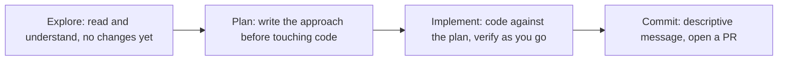
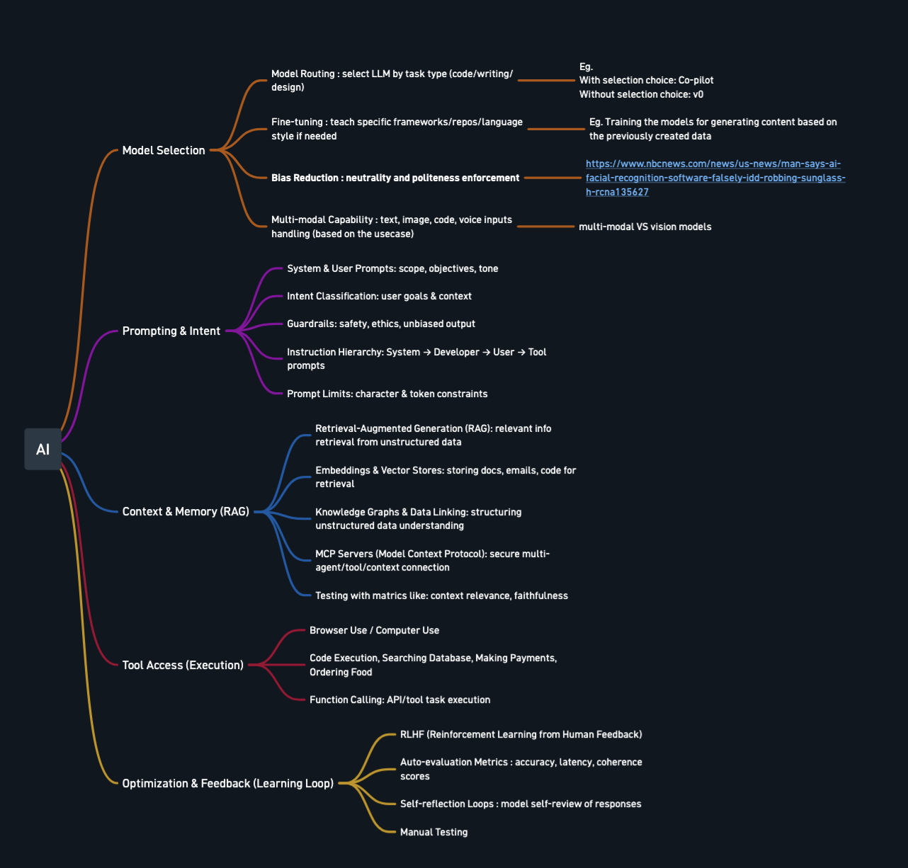
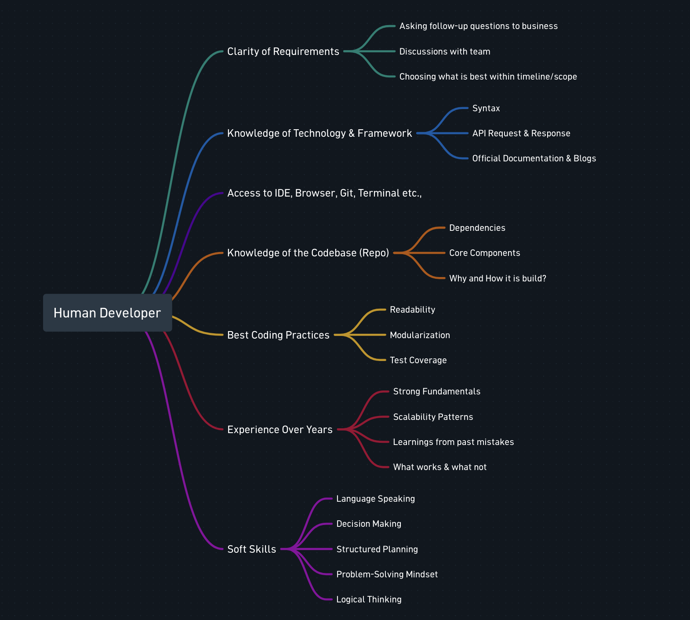

# Advanced Day 5: AI Workflows for Enterprise Software Development
**Track:** Advanced AI

---

## Scope note

This is the closing day of the programme, and it is deliberately kept light: one last concept, one capstone build that pulls together everything the eight days covered, then the close. Day 2's describe-don't-prescribe becomes giving Claude room to explore before planning, and Advanced Day 2's Reflexion pattern returns in a two-agent, dev-specific form inside the capstone review step.

**Recap:** open with a recap of Advanced Day 4.

---

## First half: one last concept, then build everything you know into one thing

---

## Explore, plan, implement, commit

**Purpose:** letting an agent jump straight to coding produces code that solves the wrong problem, the same failure Day 2 was designed around in miniature. This is the one ritual worth teaching on this day, and it is what the capstone build below runs on.

Planning is not free, it adds overhead, and it is not always worth it. The guidance is direct: if the change could be described in one sentence, skip the plan and go straight to it. Planning earns its cost when the approach is genuinely uncertain, the change touches multiple files, or the codebase is unfamiliar.

The explore step is doing the same job a good developer already does before writing a line of code, asking follow-up questions, checking with the team, understanding what is actually being asked before committing to an approach. Nothing here is a new skill, it is an old one, aimed at a new teammate.

---

## Capstone build

**Purpose:** everything up to this point has been taught one piece at a time. This is where it stops being separate pieces. Build one real, complete thing that actually uses what the whole programme covered, not a toy example of any single idea in isolation.

In pairs, build one system that includes, at minimum:

1. **At least one LLM call with a real system prompt**, Day 1's input/output contract, not a one-off chat message.
2. **At least one real integration**, Gmail, Slack, a database, whatever the pair actually has access to, Advanced Day 1's node-by-node build.
3. **A RAG lookup into a real document**, Advanced Day 4, so the system is drawing on something it was not told directly.
4. **If the pair has time, a second agent handling one piece of it**, Advanced Day 2's orchestration, handed off rather than done by the one agent doing everything.

One concrete shape this could take: an internal support assistant. It answers questions by retrieving from the team's own documentation, RAG. It checks or acts on something real through an integration, looks up a ticket, sends a message. It holds its tone and scope through a properly designed system prompt. If extended, anything outside its scope gets handed off to a second, more specialised agent.

Build it the way Advanced Day 1 taught, plan before touching the canvas, test each piece alone before wiring it to the next, only run the whole thing once every piece has already been proven on its own. Before calling it done, have someone else, or a fresh session, review the finished thing against the plan, not the reasoning behind it, the same two-agent review idea from Advanced Day 2's Reflexion pattern.

---

## Second half: recap and reflection

---

## Closing the programme

This is the last day of an eight-day arc. Per the standing structure, this is the natural point for the programme's closing reflection, not just this day's, looking back across the whole thing: what changed in how the room approaches AI, from Day 1's first prompt through to building a workflow of their own.

### The closing image

Show the two mindmaps side by side, exactly as they are, no rebuild:

The point to land, out loud, as the actual close of the programme: every branch on the left has a direct mirror on the right. Model Selection is the same judgement call as a developer choosing the right tool or framework for the job. Prompting and Intent is the same discipline as a developer getting clear on requirements before writing a line. Context and Memory is the same thing as a developer's knowledge of the codebase, why it is built the way it is, what depends on what. Tool Access is the same as having access to the IDE, the terminal, the browser, git. Optimisation and Feedback, RLHF, self-reflection loops, manual testing, is the same thing as a developer's years of experience, learning from what worked and what did not.

Eight days ago, the room started with a single prompt. The close of the programme is this: building a good AI system was never a different discipline from being a good developer, it is the same judgement, aimed at a new kind of teammate.

### Closing reflection

Per the standing structure, this is the point for the programme's full closing reflection, not just today's. Three questions worth actually asking the room, not rhetorical:

1. What is one thing you now do differently with AI, compared to Day 1?
2. Of everything covered, what are you most likely to actually use next week?
3. What still feels shaky or unclear, worth naming now rather than quietly staying a gap?

---

## Resources

- [Anthropic, Best practices for Claude Code](https://code.claude.com/docs/en/best-practices), source for the explore-plan-implement-commit workflow
