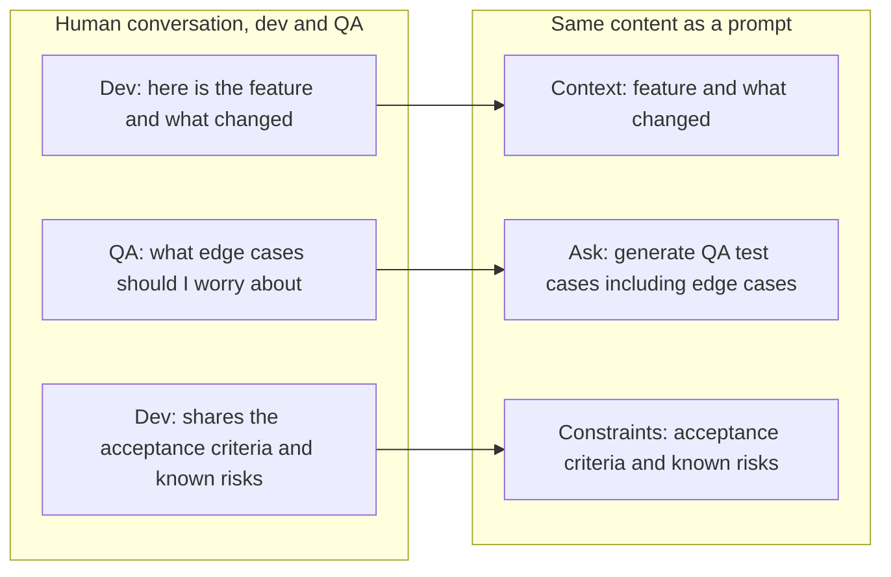

# Day 1: Hands-On Prompting & Workplace Applications

**Track:** From Prompting to Workflows

---

## Opening

**Purpose:** any multi-day programme needs the room aligned before content starts, this isn't AI-specific, it's the same opening any workshop needs. Skipping it costs you later, people who haven't voiced a concern or a hope tend to disengage quietly rather than say so.

The standard kickoff for day one of any multi-day programme, before content starts.

- Introductions and ice-breaker
- Engagement format, how the day and the programme will run
- Hopes and concerns
- Key pain points for the team
- Norms, working agreements for the room
- Ensure the baseline survey is filled in

---

## Framing

**Purpose:** open the day by establishing that prompting isn't one skill, so the room doesn't walk away thinking one technique or one style of prompt covers everything they'll do with AI. This sets up why the day splits into two genuinely different parts, Using AI and Building AI Systems, rather than teaching prompting as one flat topic.

Prompting is not one skill, it changes shape depending on context. Using any AI chat interface directly is a conversation. Building an AI system or making an LLM call is closer to designing a contract between request and response. Using an AI tool (Copilot-style, claude code) means the prompting largely already happened for you, your job is steering it with user prompt.

---

## Part 1: Using AI

**Purpose:** this part is about the everyday, conversational use of AI. The skill being taught here is identifying, identifying the problem, identifying the pattern in what you keep doing, identifying what's actually going on, not memorising a fixed technique. Prompting in this mode is closer to how you'd brief a colleague than to a formal method. Contrast this deliberately with Part 2, once you're building an AI system or making an LLM call inside code, the skill shifts from identifying patterns in a conversation to designing a reliable request/response contract, that's why Part 2 leans on named techniques instead.

**One-liner principle:** mix techniques based on identifying patterns, not one fixed method, identifying the use case, the repetitiveness, what's actually going on in the problem. A prompt's length and structure follow the problem itself and how you're trying to solve it, not a simple rule of small problem, short prompt, and large problem, long prompt.


**Example, one clear ask:**

```
Fix spelling and grammar mistakes in this email and make it more formal and polite.
```

**Example, a complex, multi-part problem (planning a migration):**

```
Role: You are acting as a senior platform engineer helping me plan a migration for my team.

Context: We currently have a notification service that publishes and consumes events through RabbitMQ. It handles email, SMS, and push notification triggers across three other services. We're moving to Kafka because of throughput and replay requirements the team has run into over the last two quarters.

Task: Help me think through and produce a migration plan from RabbitMQ to Kafka for this service.

What I want you to cover:
- the order of migration steps, and why that order
- how to avoid downtime or dropped events during the cutover
- what needs to run in parallel versus what can be a hard cutover
- a rollback plan if something goes wrong mid-migration
- what changes for the three consuming services
- what to monitor before, during, and after the migration

Constraints:
- we cannot have more than five minutes of downtime
- we have a team of four engineers and roughly three weeks
- we are already running Kafka elsewhere in the org, so the infrastructure exists

Before you produce the plan, ask me any clarifying questions you have about the current setup, the consuming services, or the constraints above, I'd rather answer questions than have you guess.

Once you have what you need, generate the final plan as a markdown document with clear phases, and call out any assumptions you made explicitly.
```

Both are prompts, the shape follows the problem, not a size rule.

### Human analogy (visual, two columns)

**Purpose:** give the room a concrete, human check for whether a prompt has enough in it. If you wouldn't hand this task to a colleague with this little context, the model needs more too, that's the test to teach, not a checklist of prompt components to memorise.

Left column: a Slack-style exchange between a developer and a QA persona, in their own words, talking about a feature that needs testing.
Right column: the same exchange translated into a single prompt, a QA-generation prompt built from what the developer actually said.




The point: a good prompt is just a compressed, well-structured version of a conversation you'd already have with a colleague. If you wouldn't hand a task to a colleague with that little context, don't hand it to the model that way either.

---

## Part 2: Building AI Systems & LLM Calls

**Purpose:** this part is deliberately a different mode from Part 1. When you're building an AI system or making an LLM call inside code, you're not having a one-off conversation, you're designing a request/response contract that has to hold up reliably every time it runs, not just once in a chat window. That's why this part is anchored on named, describable techniques rather than open-ended identifying-patterns, techniques give something concrete to point to and reuse, the way Part 1's conversational skill can't be handed off as easily.

Framing line: here, "prompting" is less about wording and more about how you structure the request you send and the response you expect back, most of the craft is in the shape of the input/output contract, not the phrasing.

Top techniques (source for more: [promptingguide.ai](https://www.promptingguide.ai/techniques)):


| Technique          | What it is                                                                                                      | When to use                                                                                                                  |
| ------------------ | --------------------------------------------------------------------------------------------------------------- | ---------------------------------------------------------------------------------------------------------------------------- |
| Few-shot prompting | Show the model a small number of input/output examples before asking it to do the real one                      | When the output format or style is specific and hard to describe in words, easier to show than tell (Specially JSON Formats) |
| Chain-of-thought   | Ask the model to reason step by step before giving the final answer                                             | When the task needs multi-step reasoning, e.g. debugging, root-causing, planning                                             |
| ReAct              | Model alternates between reasoning and taking an action (e.g. calling a tool), then reasons again on the result | When the task needs the model to look something up or act mid-task, not just answer from what it already knows               |
| Prompt chaining    | Break a large task into a sequence of smaller prompts, each one's output feeding the next                       | When one prompt is trying to do too much at once and quality drops, split it into stages                                     |

**Worked example: a real LLM call (few-shot, system prompt + user prompt, JSON output)**

This is what an actual LLM call in code looks like, as opposed to a chat conversation. The system prompt is calibrated once and reused on every call, the user prompt is the only part that changes per call, and the examples inside the system prompt are what make this few-shot.

*System prompt (fixed, reused on every call):*

```
# Role
You are a triage assistant that converts raw bug reports into structured tickets.

# Task
Given a raw bug report, extract the fields below and classify severity.

# Examples

## Example 1
Input: "The app crashes every time I upload a PDF larger than 10MB on Safari."
Output:
{
  "summary": "App crashes on PDF upload over 10MB in Safari",
  "component": "file-upload",
  "browser": "Safari",
  "severity": "high",
  "reproducible": true
}

## Example 2
Input: "Minor: the button label says 'Sumbit' instead of 'Submit'."
Output:
{
  "summary": "Typo in submit button label",
  "component": "ui-copy",
  "browser": null,
  "severity": "low",
  "reproducible": true
}

# Output format
Return only valid JSON matching this schema, no extra commentary:
{
  "summary": string,
  "component": string,
  "browser": string or null,
  "severity": "low" | "medium" | "high",
  "reproducible": boolean
}
```

*User prompt (the only part that changes, one per bug report):*

```
Input: "Every time I try to export a report as CSV on the Android app, the file downloads empty. Happens consistently, tested on three different phones."
```

The point to land: the system prompt is doing the heavy lifting, role, task, few-shot examples, and the exact output contract, once, and the user prompt stays small and disposable. This is the shape referenced in Part 2's framing line, prompting here is mostly the system prompt design, not the wording of any one call.

---

## Common mistakes to correct in this session

**Purpose:** name these three failure modes explicitly so the room can self-diagnose during Day 2 and Day 3's hands-on work, rather than every instance needing to be caught live.

1. Vague prompts, no clear ask
2. Incomplete prompts, missing context the model needs to do the task well, setting the environment right, question-answer format
3. Expecting the model to compensate for a bad prompt, blaming the model for what is actually a prompting gap

---

