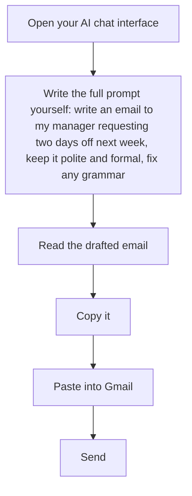
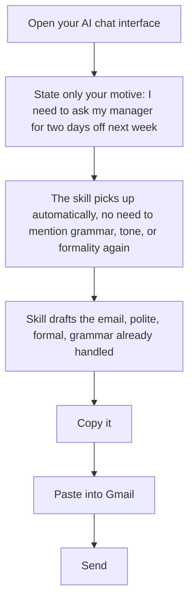
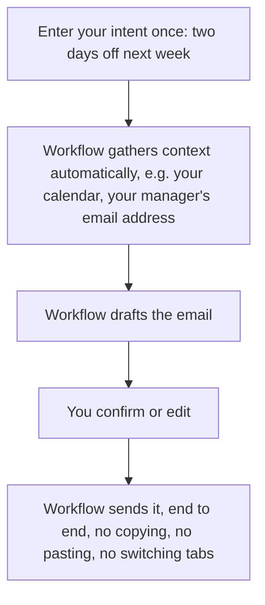

# Day 3: Introduction to Agentic Workflows

**Track:** From Prompting to Workflows

---

## Scope note

This day covers agentic *workflows* only, not multi-agent systems or orchestration, that's reserved for Advanced AI Days 1-2. The two are different rungs on the same ladder, not a repeat of each other: workflow means a predefined, fixed sequence of steps; agent means the LLM itself decides the steps for an open-ended problem. Day 3 stays on the fixed-sequence side.

---

## Recap

Open with a recap of Day 2, per the standing daily structure.

---

## Concept block (~2 hours, discussion and interaction-driven, anchored on the email example)

**Purpose:** the room already knows prompting (Day 1) and has solved one real problem with it (Day 2). This block exists to show them the ceiling of prompting alone, the manual glue work that's still left even with a well-built skill, and to name what closes that gap. The email example is one continuous thread deliberately, so the room feels the ladder rather than being told about it.

### The ladder

Build up the ladder using the corrected email example:

1. **Prompting**: a single LLM call, refined conversationally. Not a workflow.
2. **Skill**: a reusable, packaged prompt. Still one LLM call under the hood, the human still does all the connecting (copying into Gmail, finding the recipient, CC, subject, review, send). Not yet a workflow either.
3. **Agentic workflow**: the connecting steps get wired together automatically instead of carried by a person, fetch context, draft, human-in-the-loop confirm, land the draft, and once trusted enough, send outright.

One running example throughout, relatable to anyone in the room: emailing your manager to request two days off next week. Three diagrams below, same example, showing what you as a person are actually doing at each stage, not just what the system is doing.

**Stage 1, Prompting:**

**Stage 2, Skill:**

**Stage 3, Agentic workflow:**

What should stand out across the three: the persona's own steps get shorter each time, prompting has you doing five things by hand, the skill removes one, the workflow removes almost all of them.

### Definition

Agentic workflow: LLM(s) and tools chained together, where the hand-off between steps is automated rather than carried by a person. Contrast directly with an agentic coding tool they already use (Claude Code, Cursor, GitHub Copilot, Windsurf): those are agentic systems too, and tool calls and hand-offs happen automatically *within one session with some features and customisation available in some of this tools*. But the moment you copy output from one task and paste it into a prompt for a separate task, a human is doing that wiring, not the system. Whether the hand-off is automatic or person-carried is the actual dividing line, not whether you can see the prompt.

### Why the automation is even possible

Fixed output shape, dynamic values. A node's output keeps a consistent structure even though its content changes each time, which is what lets the next node consume it directly with no human interpretation in between. Direct callback to Day 1: prompting for LLM calls is mostly about designing that input/output contract.

### Two places to build the same underlying pattern

**Purpose:** the reasoning behind this choice matters more than the choice itself, "just use n8n" is the flattened version. The decision isn't about which tool is better, it's about matching the build location to who the audience actually is, get this wrong and either developers do unnecessary extra configuration, or non-technical stakeholders get handed something they can't touch.

1. **Inside the agentic tools they already use** (Claude Code, Cursor, GitHub Copilot, Windsurf), configuring tool access and hand-offs, with their own chat input effectively acting as the dynamic user prompt. Frictionless for people who already have repo access and already use these tools day to day.
2. **Built from scratch in a visual platform** (e.g. n8n), deployed somewhere so it can be used by anyone with the right access and authorisation, regardless of whether they use these dev tools at all.

**Decision heuristic for which to use:** if the use case lives in the codebase and the audience already has repo access and uses these dev tools daily, build it inside the tool they already have. If the audience sits outside that world (e.g. a manager with no GitHub account, no appetite for cloning repos and installing dependencies), build and deploy it as a standalone workflow instead, so all they need is authorisation, not the underlying tooling.

### Why this matters for non-technical stakeholders

On a visual, no-code platform, you don't need to understand LLMs or agents in depth. You need to know four things: system prompt, dynamic user prompt, which tools to integrate, and what access those tools need. That's what makes it usable by someone who has never written a prompt.

---

## Hands-on (second half)

- Everyone builds the same workflow: the email example, end to end. Assumption is n8n is what's available to them.
- Fallback: anyone who can't get a tool connection working scopes down to something smaller they can complete on their own.
- In parallel, one pair builds a separate small, complete, end-to-end workflow (Day 2's problem or a new one, just small enough to finish within the session).
- Coach keeps a pre-built, already-working version of the email workflow ready to demo and drive live, so the room sees one complete working example regardless of who gets stuck on connections.

---

## Close of day

1-2 showcases, the parallel pair(s) demo their finished workflow to the room.

---

## Resources

- [Anthropic, Building Effective Agents](https://www.anthropic.com/engineering/building-effective-agents), source for the workflow-vs-agent distinction underpinning this whole day
- [n8n](https://n8n.io), the assumed hands-on platform
- [Dify](https://dify.ai), the alternative visual workflow platform referenced in the "two places to build" discussion

